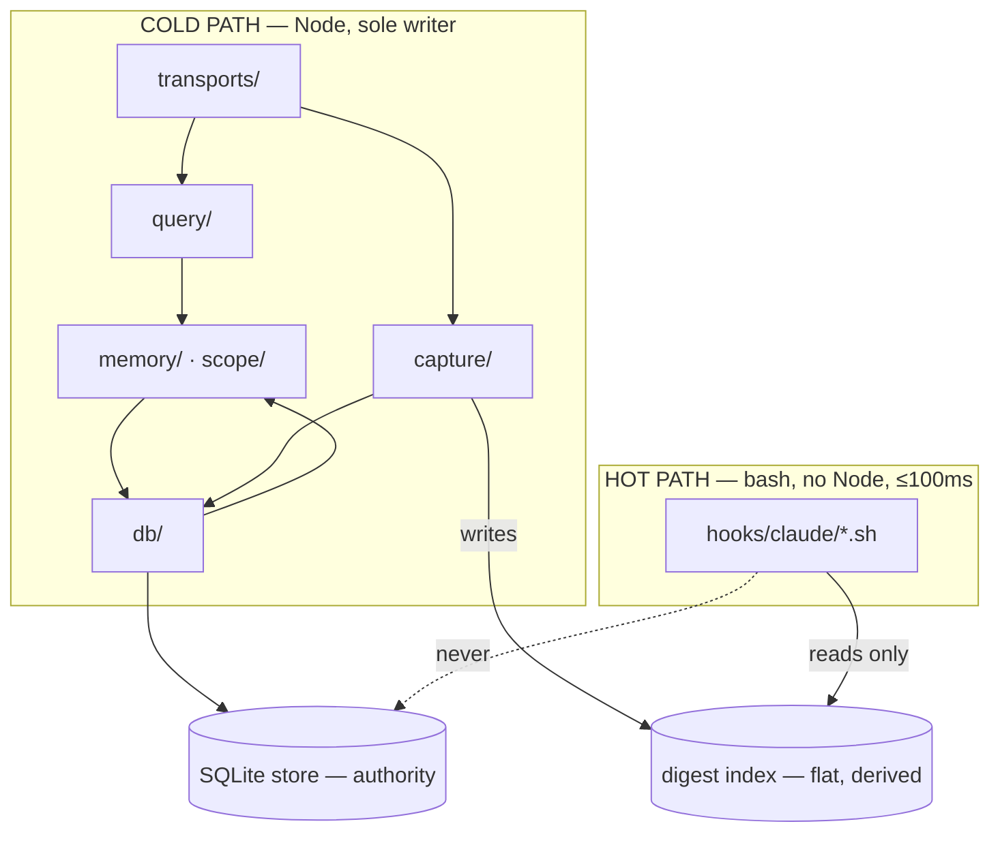
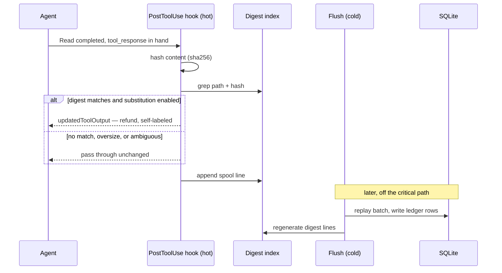
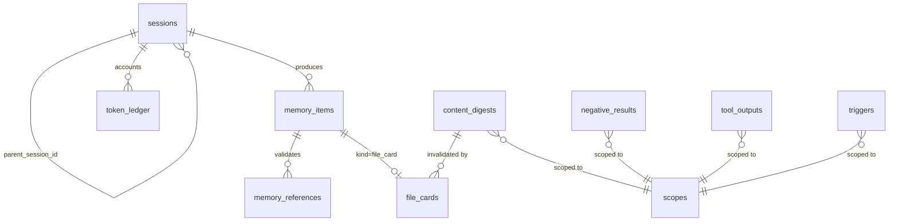

# Architecture Spine — Cortex: Context Economy

## Design Paradigm

**Layered core with a Node-free hot-path projection.**

The existing layered core is ratified as-is — `transports/` → `query/` → `memory/` + `scope/` → `db/`, one-way, with `db/` importing `memory/items` only for text shaping. Every R1–R4 module slots into an existing layer. No new top-level layer is introduced.

What *is* new is a second execution context. The read-refund feature must answer during a PostToolUse hook, where spawning Node is forbidden (N-4) and the budget is 100 ms (B-4a). *(B-4a amended 2026-08-02: split by outcome, miss ≤100 ms / hit ≤300 ms p95 — see PRD §10. The architectural consequence — hot path reads a flat projection, never SQLite — is unchanged.)* That work cannot reach SQLite. So the architecture grows a **hot path**: a read-only, Node-free consumer of a flat projection that the cold path writes. The core still owns all truth; the hot path only ever reads a derived artifact it could not corrupt if it tried.

| Layer | Directory | Execution context |
| --- | --- | --- |
| Transports | `src/transports/` | cold |
| Query | `src/query/` | cold |
| Memory / Scope | `src/memory/`, `src/scope/` | cold |
| Persistence | `src/db/` | cold — **sole writer** |
| Capture spool + digest index | `src/capture/` writes; `hooks/claude/*.sh` reads | cold writes, **hot reads** |

## Invariants & Rules

### AD-1 — Layer direction is one-way *(ADOPTED — ratified from existing code)*

- **Binds:** all
- **Prevents:** cyclic dependencies; a query reaching into a transport; the store growing knowledge of retrieval.
- **Rule:** `transports/` → `query/` → `memory/` + `scope/` → `db/`. `db/` may import `memory/items` for text shaping only. No module imports upward. New R1–R4 modules join an existing layer; adding a top-level layer requires amending this AD.

### AD-2 — Two execution contexts, one writer

- **Binds:** FR-5, FR-6, FR-12, FR-13, FR-14, FR-15; N-4; B-4, B-4a
- **Prevents:** the read-refund path silently violating the no-Node-per-tool-call invariant; two processes writing one SQLite store; a hook that blocks the user's turn on database contention.
- **Rule:** The **cold path** (Node) is the sole writer of the SQLite store. The **hot path** (bash hook) is read-only, spawns no Node, and never opens SQLite. Any capability needed at hook time must be expressible against the flat projection in AD-3. If it cannot be, it does not belong in the hot path.

### AD-3 — The digest index is derived, flat, and regenerable

- **Binds:** FR-5, FR-6, FR-10, FR-12, FR-14
- **Prevents:** the hot path acquiring a parser or a schema; the index becoming a second source of truth; index loss counting as data loss.
- **Rule:** One line-oriented, append-mostly text file per store, written **only** by the cold-path flush and read **only** by the hot path. Every record is locatable with `grep` alone — no JSON parsing in the hook. The index is fully regenerable from SQLite; deleting it degrades performance, never correctness. It is never the authority for anything, only a cache of what the authority already knows.

### AD-4 — Only knowledge projects into `memory_items`

- **Binds:** FR-10, FR-11, FR-12, FR-14, FR-19; all retrieval
- **Prevents:** lookup rows flooding the ranking and displacing real memory; file cards being unreachable by recall because they were filed as infrastructure.
- **Rule:** Apply one test — *would a person ever ask to recall this?*
  - **Projects:** notes, episodes, command runs, snapshots, session summaries, **file cards**. Subagent findings project as *episodes* when captured automatically; note-shaped findings go to the non-mutating suggestion path and project only once a human or the parent accepts them (FR-19).
  - **Does not project:** content digests, negative results, tool-output records, read-ledger entries, claims. These live in dedicated tables with their own query paths and are never retrieval candidates.
  A row that projects carries `scope_type`, `scope_key`, `kind`, `state`, `importance` and participates in decay. A row that does not project is a lookup structure and is queried by key, never ranked.

### AD-5 — A new `memory_items` kind ships with its own eval fixture

- **Binds:** FR-10, FR-19, FR-44; SM-3
- **Prevents:** a new memory kind reaching production with zero regression coverage while the locked suites report green.
- **Rule:** The quality gate compares only `top1_hit`, `recall_at_3`, `noise_count`, `stale_count`, and `output_tokens`, and it runs against hermetic seeded scenarios. A kind that no fixture seeds is not *penalised* by the suites — it is **invisible** to them. Therefore: any change introducing a new `kind` value into `memory_items` must add a locked fixture exercising that kind in the same change. Table counts recorded in baselines are informational and are not a gate; do not treat a matching count as evidence of anything.

### AD-6 — Certainty requires evidence in hand

- **Binds:** FR-6, FR-11, FR-13, FR-15; N-9; SM-C3
- **Prevents:** the single failure that would end this product's credibility — a confident, wrong assertion the agent acts on.
- **Rule:** Any output asserting `unchanged`, `no matches`, or a cached command result must derive from data held at decision time, not inferred from a proxy. Re-hash; never trust mtime. Ambiguity resolves to a **miss**, never to the convenient answer. An assertion path that cannot produce its evidence must not make the assertion.

### AD-7 — Refunds are post-hoc and verified, never pre-emptive

- **Binds:** FR-6; §5 Non-Goals; B-4a
- **Prevents:** Cortex denying a tool call the agent genuinely needed; a substitution made on a guess.
- **Rule:** Read refunds use `PostToolUse` → `hookSpecificOutput.updatedToolOutput` **only**. `PreToolUse` → `permissionDecision: "deny"` is never used for economics. Substitute only when the just-read content hashes to the recorded digest — the claim is made while holding the bytes it describes. The substituted payload names itself as a substitution and states the full content's token cost. A second read of the same file within one turn passes through unsubstituted. Substitution is off until explicitly enabled.

### AD-8 — The token ledger is double-entry and evidence-bearing

- **Binds:** FR-8, FR-9; SM-1, SM-2, SM-C1
- **Prevents:** the headline metric flattering itself into fiction; savings credited for work that might not have happened.
- **Rule:** Every ledger row is append-only and carries direction (`injected` | `saved`). A `saved` row must name the specific avoided action and the recorded size that justifies the credit. No modeled, estimated, or counterfactual credit — if the avoided action is not observable, there is no row. Cases where a surface was available and unused are recorded separately as *unrealized*, never folded into savings. Ledger writes share the transaction of the operation they describe.

### AD-9 — Session identity is `(scope_key, agent_id)`

- **Binds:** FR-17, FR-18, FR-19, FR-20
- **Prevents:** subagent activity merging into the parent's timeline — a defect present in the current code, where session resolution keys on `cwd` alone.
- **Rule:** A hook payload carrying `agent_id` resolves to a **child** session, created on demand with `parent_session_id` set to the scope's active primary session and `agent_type` from the payload. A payload without `agent_id` resolves to the primary session. No capture is ever attributed to a session whose `agent_id` differs from the payload's. This is a **bug fix and lands before** the §4.4 feature work.

### AD-10 — One store per repository, addressed by common-dir

- **Binds:** FR-24, FR-25, FR-33; Risk R-4
- **Prevents:** worktrees fragmenting into separate stores; a moved repository orphaning its memory; a fork silently inheriting upstream's decisions.
- **Rule:** Store identity is a hash of the absolute realpath of `git rev-parse --git-common-dir`, so every worktree of a repository resolves to one store — worktree partitioning is already handled internally by `scope_key`, not by file layout. The root-commit OID is recorded alongside as a **repair anchor**: on a cold start with no store at the computed path, a store whose root-commit matches and whose recorded path no longer exists is a moved repository and adoption is offered. Without git, fall back to a hash of the working directory realpath and report the degradation. Migration from a project-root store copies, verifies, then leaves the original in place.

### AD-11 — Migrations are additive, idempotent, and survive partial application

- **Binds:** all schema change; N-8, P-5
- **Prevents:** a user's memory being destroyed or left unopenable by an interrupted upgrade.
- **Rule:** One `SCHEMA_VERSION` increment per release, not per table. Every migration uses `CREATE TABLE IF NOT EXISTS` / `ensureColumn` and is safe to re-run. A migration interrupted at any statement boundary must leave a store the previous binary can still open. No migration drops a column or a table holding user-authored content. Adding a table still requires the four coordinated edits in `src/db/schema.ts`.

### AD-12 — Degradation is silent and total

- **Binds:** all; N-3
- **Prevents:** a memory-layer failure surfacing as an error in the user's coding session.
- **Rule:** Any failure — corrupt store, missing index, unreadable spool, absent git, absent model — degrades to producing nothing. Hooks exit 0. No Cortex failure may block, error, or annotate the user's turn. `cortex doctor` is the one place failures are reported, because the user asked.

### AD-13 — Model use is opportunistic, never required

- **Binds:** FR-10, FR-11; N-5
- **Prevents:** a core capability becoming unavailable because no model was reachable.
- **Rule:** Every capability has a deterministic path that is the default. File cards derive from AST/LSP symbols, the leading doc comment, and existing notes referencing the file. Model enrichment is an additional, optional path invoked by the agent, and enriched content is labeled as model-derived. No production code path blocks on a model.

### AD-14 — Derived content is owned by its source, not by decay

- **Binds:** FR-10, FR-11, FR-16; `db/gc.ts`
- **Prevents:** two independent deletion paths for one file card — generic decay-GC destroying a valid card whose source file never changed, or card-eviction orphaning a `memory_items` projection.
- **Rule:** A `memory_items` row that is *derived from a source artifact* (today: file cards) does not participate in decay-driven deletion. Its `state` may still change for ranking purposes, but `archived` is never a deletion trigger for it. Such a row is deleted only when its source is — digest changed, digest gone, or file absent from the app graph — and that deletion removes the row and its projection together, in one transaction. Generic archived-item GC must exclude derived kinds explicitly. Decay measures relevance; source validity is a different clock, and the source wins.

### AD-15 — Hot-path credits are deferred, not transactional *(amends AD-8)*

- **Binds:** FR-6, FR-8; AD-2, AD-8
- **Prevents:** the deadlock between AD-8's transactional requirement and AD-2's no-SQLite-in-the-hot-path rule — which would otherwise leave the product's single most important credit, the read refund, unbookable.
- **Rule:** AD-8's "shares the transaction of the operation it describes" binds **cold-path operations only**. A credit originating in the hot path is emitted as a spool record carrying its own evidence (path, digest, recorded byte size, timestamp) and is booked by the cold-path flush, under spool exactly-once semantics. The evidence requirement is unchanged and absolute: a deferred credit still names a specific avoided action and its recorded size, or it is not written. A refund whose spool record is lost is simply never credited — under-reporting is acceptable (SM-C3), inventing the row later is not.

### AD-16 — Refund eligibility is per-session, not per-scope

- **Binds:** FR-5, FR-6, FR-7; AD-3, AD-9; SM-C3
- **Prevents:** the false-confidence failure where a subagent's read populates the shared digest index and the *parent* is later told "unchanged since you read it at 14:02" about a file it has never read.
- **Rule:** The digest index records **who read it** — the reading session's id and `agent_id`. A refund may be served only when the reading session is the requesting session itself, or a direct ancestor of it. A digest recorded by a sibling or descendant session is a valid change-detection fact but is **not** refund-eligible, and any surface reporting it must attribute it explicitly ("read by subagent *X* at …") rather than saying "you read it". Change detection is scope-wide; the claim "you already have this" is session-bound.

### AD-17 — Contradiction suppresses automatic demotion

- **Binds:** FR-1, FR-2, FR-4
- **Prevents:** the system simultaneously declaring two decisions contested and quietly resolving the contest by demoting one — violating FR-1's explicit "automatic resolution is the user's".
- **Rule:** Conflict detection runs **before** auto-demotion and vetoes it. When a new decision on a subject is found to contradict an active decision on that subject, both are marked contested and **both retain their current state** — no tier change on either side. Demotion resumes only once the conflict is closed through `cortex_resolve`. A new decision that does *not* contradict its predecessor demotes it as normal. Contested pairs are equals until a human breaks the tie.

### Dependency direction



### Execution-context boundary



### New persistence shape



## Consistency Conventions

| Concern | Convention |
| --- | --- |
| Naming — tables | `snake_case`, plural, one noun (`content_digests`, `negative_results`, `tool_outputs`, `file_cards`, `triggers`). |
| Naming — row types | `XRow` for the raw row, `ParsedX` for the hydrated form. Both exported. |
| Naming — files | `kebab-case.ts`, one module per concern, test file mirrors the name. |
| Ids | Application-generated string ids, never autoincrement. Digests keyed by `(scope_key, path)`. |
| Time | ISO-8601 UTC strings in `TEXT`. Rendered compact as `YYYY-MM-DD HH:mmZ`. Never epoch numbers, never `Date` objects at the boundary. |
| Hashes | `sha256`, lowercase hex, full length in storage; first 12 chars acceptable in rendered output. |
| Cache keys | Always include `scope_key` and, where the answer depends on tree state, `head_oid`. A key that cannot express its invalidation condition is not a valid key. |
| Scoping | Every new table carries `scope_key TEXT NOT NULL`. Nothing is global except the `user` scope introduced in R3. |
| Errors | Core query/store paths throw. Capture, hook, and transport edges swallow with a `catch {}` carrying a comment stating why (AD-12). |
| Output budgets | Every user-facing surface accepts `budget` and drops lowest-priority content first. No surface renders unbounded. |
| Labeling | Derived or model-generated content is always labeled as such. Substituted tool output always names itself. |
| Config | Environment variables prefixed `CORTEX_`, every feature defaulting to the conservative behavior. New behavior ships off. |
| Public surface | Every exported symbol is added to `src/index.ts` in the same change. |

## Stack

Verified against the checkout and `package.json` at HEAD `ea56586`. No new runtime dependency is introduced by R1–R4.

| Name | Version |
| --- | --- |
| TypeScript | 6.0.2 |
| Node | ≥ 18 (24.14.1 on the dev machine) |
| better-sqlite3 | ^12.8.0 |
| @modelcontextprotocol/sdk | ^1.29.0 |
| commander | ^14.0.3 |
| vitest | ^4.1.3 |
| SQLite FTS5 | bundled with better-sqlite3 |
| Claude Code host | ≥ 2.1.121 for `updatedToolOutput` on built-in tools (2.1.170 verified) |
| Hot-path toolchain | `bash`, `jq` 1.8.1, `sha256sum` (coreutils) |

## Structural Seed

```text
src/
  capture/
    digest.ts        # content hashing, oversize policy, index line format
    index.ts         # digest-index writer (cold) — the file the hot path greps
    spool.ts         # existing; extended to carry agent_id and digests
  cache/
    negative.ts      # negative-result capture and query
    tool-output.ts   # deterministic-command outcome capture and query
    cards.ts         # deterministic file-card derivation, model enrichment optional
  ledger/
    accounting.ts    # double-entry token ledger, evidence-bearing credits
  db/
    schema.ts        # +V5_TABLES, SCHEMA_VERSION 4 -> 5
    store.ts         # extended query surface
  query/
    read-ledger.ts   # the four-verdict answer surface
    conflict.ts      # contradiction detection over notes.conflict
  transports/
    cli.ts           # +stats, ls, show, doctor, adopt
hooks/claude/
  cortex-capture.sh  # extended: hash, grep index, optional updatedToolOutput
  cortex-subagent.sh # new: SubagentStart brief injection, SubagentStop write-back
```

## Capability → Architecture Map

| Capability | Lives in | Governed by |
| --- | --- | --- |
| FR-1..FR-4 Trust activation | `query/conflict.ts`, `db/store.ts` | AD-4, AD-5, AD-11 |
| FR-5..FR-7 Read ledger | `capture/digest.ts`, `capture/index.ts`, `query/read-ledger.ts` | AD-2, AD-3, AD-6 |
| FR-8..FR-9 Token P&L | `ledger/accounting.ts`, `transports/cli.ts` | AD-8 |
| FR-10..FR-11 File cards | `cache/cards.ts` | AD-4, AD-5, AD-13 |
| FR-12..FR-13 Negative cache | `cache/negative.ts` | AD-4, AD-6 |
| FR-14..FR-15 Tool-output cache | `cache/tool-output.ts` | AD-4, AD-6 |
| FR-16 Eviction | `db/gc.ts` | AD-3, AD-11 |
| FR-17..FR-20 Subagent memory | `transports/hook-entry.ts`, `hooks/claude/cortex-subagent.sh` | AD-9, AD-12 |
| FR-21..FR-26 Operability | `transports/cli.ts`, `scope/identity.ts` | AD-10, AD-11, AD-12 |
| FR-27..FR-32 Time-shifted (R2) | `query/triggers.ts` | AD-4, AD-5, AD-12 |
| FR-33..FR-38 Substrate (R3) | `scope/`, `transports/cli.ts` | AD-10, AD-11 |
| FR-39..FR-44 Depth (R4) | `query/retrieval.ts`, `query/reference-validation.ts` | AD-5 |
| Read refund | `hooks/claude/cortex-capture.sh` | AD-2, AD-6, AD-7 |

## Deferred

- **Digest-index partitioning.** Whether one index per store stays inside B-4a as it grows, or needs per-scope splitting. Deferred to the §4.3 epic behind a measurement gate — the answer is empirical and premature to fix now.
- **Index file format specifics** (field order, delimiter, compaction cadence). A story-level detail; AD-3 fixes the properties that matter (flat, greppable, derived, cold-write-only).
- **Whether `estimateTokens` is replaced with a real tokenizer.** AD-8 makes accounting evidence-bearing regardless; the estimator's error bar is a §4.2 story concern. Flagged in addendum A2.5.
- **Invariant predicate vocabulary** (FR-30). R2 owns it; fixing it now would be inventing against no requirement. PRD Q5.
- **Cross-project ranking weights** (FR-34). R3, and dependent on R1 relevance data that does not exist yet.
- **ANN indexing / sharding.** Not a problem at current scale. R3's user-scope work is the first thing that could create it; revisit then with measurements.
- **Resident daemon.** Deferred indefinitely per PRD §6.2 — real latency win, but introduces process lifecycle, crash recovery, and version-skew failure modes this architecture is currently free of.
- **Operational envelope beyond the local machine.** Cortex has no deployment, no service, no infrastructure by design (PRD §5). If R3 hosted sync is ever reconsidered, that dimension opens and this spine must be amended rather than extended silently.
